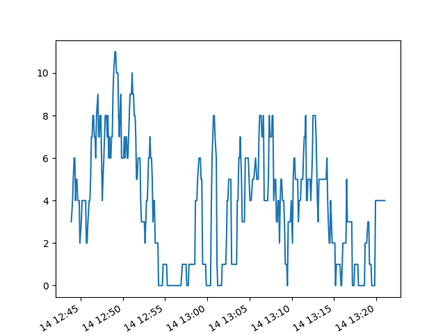
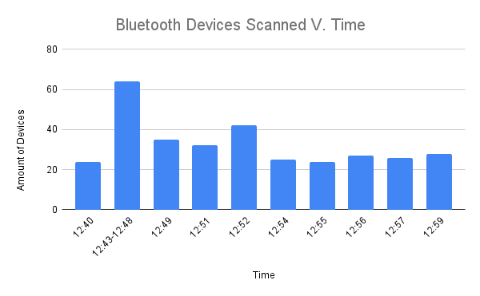

# EC463 Hardware Mini Project Report
**Fabio Amado, Linglong Le** 

This is the Report for the Hardware Miniproject Assigned to Electrical Engineers for EC463, Fall 2021.
## Wifi Section
#### Extended Wifi Data Plot

#### Discussion and Explanation of the Plot
The link above contains the plotted result from an extended wifi scan, which ran for around 35 minutes, from 12:45 PM to 1:20 PM. In this plot, it is clear that there was some variation in the amount of cars detected at any one time, with the amount of cars detected ranging from 0 to 11 at any given time. In the plot there were periods of relatively high activity from 12:47 PM to 12:53 PM and from 1:03 PM to 1:13 PM, while the almost no activity was detected from 12:53 PM to 1:02 PM. Analyzing the results, it is clear that there were more cars passing by during the periods of high activity, while there was a lull in traffic during the period of low activity. 

One reason for this pattern could be due to workers returning from their lunch break. The period of highest activity was in the region of 12:47 PM to 12:53 PM, which is just before most peoples lunch breaks end. Thus the increased traffic in this period could be from people hoping to be back into their workplaces before 1:00pm after having lunch. The peaks in activity from 1:03 to 1:13 PM could also be attributed to lunch breaks. Workplaces could have been holding company activities or group lunches that were scheduled from 12:00 PM to 1:00 pm, and as such would not be worried about being back in the office before 1:00 pm. At no point in time of this scan however, were there any deadlocks or periods of extreme congestion, as shown by the variance in the data minute by minute. Had a traffic jam occurred, then there would be a more consistent amount of cars over time, without the jumps between highs and lows in the amount of detected cars.

## Bluetooth Section

#### Extended Wifi Data Plot

### Bluetooth Data
* 1st scan 12:40 PM:
  * 24 Devices
  * 2 Named: Buds Pro, Bose AE2 SoundLink  
* 2nd scan 12:43-12:48 PM:
  * 64 Devices
  * 4 Named: Buds Pro, LE-HY BQCE1, Bose AE2 SoundLink, Tile
* 3rd scan 12:49 PM:
  * 35 Devices
  * 3 Named: Buds Pro, Tile, Bose AE2 Soundlink  
* 4th scan 12:51 PM:
  * 32 Devices
  * 4 Named: Buds Pro, Bose AE2 Soundlink, Tile, Galaxy Buds Pro (B300) LE  
* 5th scan 12:52 PM: 
  * 42 Devices
  * 4 Named: Buds Pro, Bose AE2 Soundlink, Tile, Galaxy Buds Pro (B300) LE 
* 6th scan 12:54 PM: 
  * 25 Devices
  * 5 Named: Buds Pro, LE-HY BQCE1, Bose AE2 SoundLink, Tile, Galaxy Buds Pro (B300) LE 
* 7th scan 12:55 PM:
  * 24 DEvices
  * 5 Named: Buds Pro, LE-HY BQCE1, Bose AE2 SoundLink, Tile, Galaxy Buds Pro (B300) LE 
* 8th scan 12:56 PM: 
  * 27 Devices
  * 5 Named: Buds Pro, LE-HY BQCE1, Bose AE2 SoundLink, Tile, Galaxy Buds Pro (B300) LE 
* 9th scan 12:57 PM: 
  * 26 Devices,  
  * 4 Named: Buds Pro, Bose AE2 Soundlink, Tile, Galaxy Buds Pro (B300) LE 
* 10th scan 12:59 PM:
  * 28 Devices,  
  * 4 Named: Buds Pro, Bose AE2 Soundlink, Tile, Galaxy Buds Pro (B300) LE 

#### Discussion and Explanation of Data
The data above contains the bluetooth scan results from 9 thirty seconds scans and one 5 minute scan. The raspberry pi read the bluetooth devices in its proximity and compiled the data showing the IP address and the device name. Looking at data it can be seen that the pedestrian foottraffic was miniscule and the unnamed devices are hard to identify since they could be anything from an airpod to speaker, etc. As the results show using the wifi scan would be a better option than the bluetooth scan as you can read more devices such as modern automobiles and fixed beacons such as TVs, speakers, and modern automobiles.

## Difficulties Experienced:
The main difficulties experienced were in the initial setup and startup of the Raspberry Pi. For the Raspberry Pi to properly display to the HDM monitor, it had to have the connections to the HDMI port, mousepad, and keyboard before power was supplied. Additionally, the Raspberry Pi had troubles with connecting to the BU campus Wifi. To solve this, a mobile hotspot was used instead to connect to the internet so that the scans could proceed.
